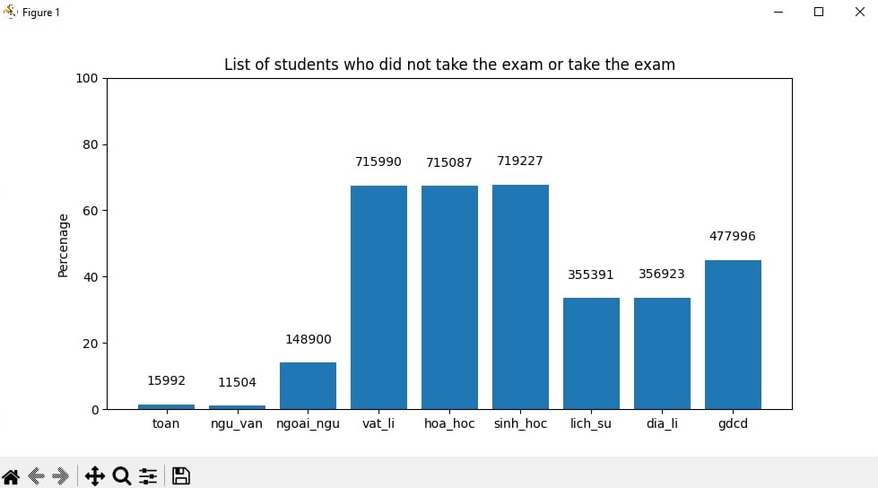
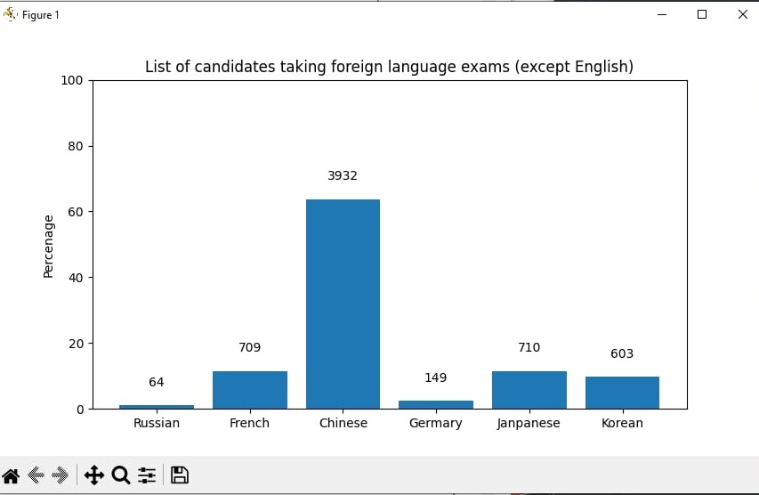
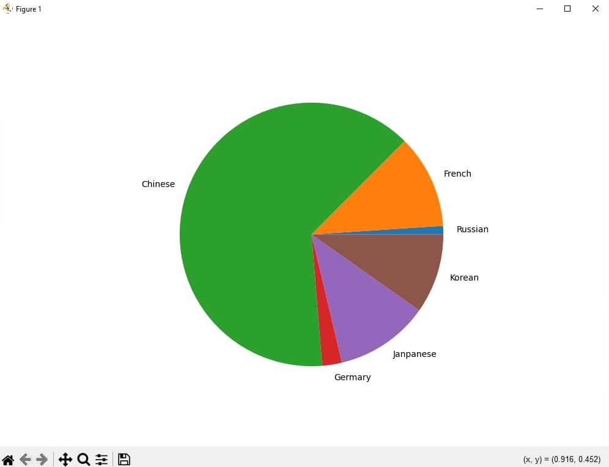

<h1>My Project anylize Score of Student University for year 2024 </h1> 
<h2>List Student Who did not take the exam or take the exam </h2>

We can see quantity student didn't take exam field natural (vat_li , hoa_hoc, sinh_hoc) than  field social (lich_su, dia_ly_gdcd)
. I can predict students love industry marketing , social media , news . I think it have a higher chance of getting a job than natural field.
On the contrary, the fields of science and technology require a certain level of education and many years of continuous learning. The salary after graduation is not stable and some fields in this field have a slower graduation progress than other fields. For example, the medical field.

<h2>List of Candiatế taking foreign language exams (excpet English)</h2>

When looking at this chart, we can easily see that the foreign language subject that students in 2024 like to learn is Chinese the most. Except for English, which is a compulsory subject for most students. And next are Japanese, French, and Korean. What is quite surprising when looking at this chart is that the number of French is quite high. Japanese and Korean are quite popular after Chinese in Vietnam because these are the countries that students prefer to study abroad or work abroad after Chinese. I can partly predict that France is a country with a special living standard, allowances, or tuition fees at French schools that have attracted quite a large number. And the remaining two subjects, German and Russian, are not popular in Vietnam, which is not too surprising to me.

